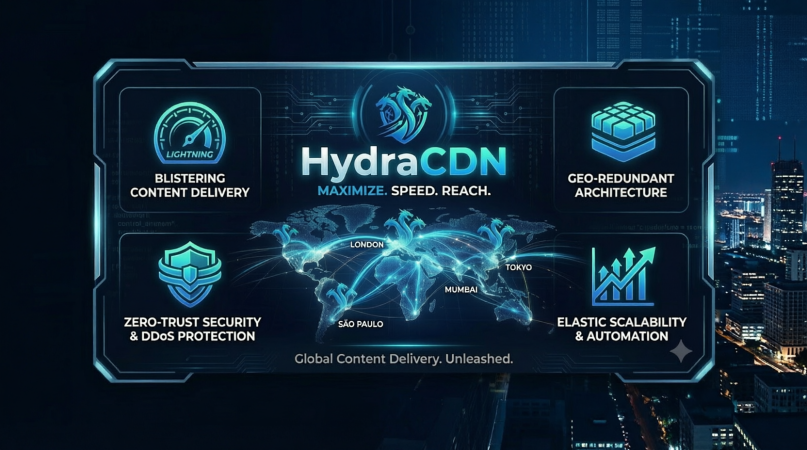

# HydraCDN (UltraBackend Prod Stack)

An ultra-fast, high-throughput, Just-In-Time (JIT) Image Transformation Service built in modern C++. It leverages asynchronous non-blocking network I/O, fine-grained multi-threaded bucket caching, and bare-metal SIMD image processing to crop and scale images entirely in-memory.

---

## 🚀 Core Architecture Features

* **Asynchronous Networking:** Powered by **Drogon** (built on Linux `epoll`), bypassing standard thread-per-connection scaling limits.
* **SIMD Image Processing:** Utilizes **libvips (via C++ bindings)** for lightning-fast image mutations without expensive runtime VM overhead.
* **Concurrent Memory Layout:** Implements **Intel oneTBB (`concurrent_hash_map`)** featuring row-level thread safety to avoid global lock contention.
* **Resource Defensiveness:** Bound memory footprint with automatic probabilistic eviction (hard-limited at 1000 items) to guarantee system uptime.

---

## 🛠️ Prerequisites & System Layout

Your workspace currently maps out as follows:
```
ultra_backend/
├── main.cpp                 # Main HydraCDN engine source
├── CMakeLists.txt           # Build automation configuration
├── conanfile.txt            # Modern C++ dependency package manager
├── build/                   # Compilation sandbox target directory
├── scripts/
│   └── exec.sh              # Fast build and execution automation script
└── README.md                # Project documentation
```
### Build Dependencies
Ensure your Arch Linux development machine has the system requirements satisfied:
```
sudo pacman -S base-devel cmake conan libvips tbb spdlog
```
---

## 🔨 Compiling & Running

The compilation sequence forces optimization flags (`-O3`), auto-vectorization, and maximizes your CPU cores via parallel processing pipelines.

To build the executable manually or understand the shell runner (`scripts/exec.sh`), execute the script from the root workspace:

# Provide permissions if required
```
chmod +x scripts/exec.sh
```
# Run the automated compilation pipeline
```
./scripts/exec.sh
```
### Under the Hood of `scripts/exec.sh`:
```
set -e # Terminate script immediately if any compilation line throws an error

cd build
# 1. Generate build definitions for high performance optimized machine code targets
cmake .. -DCMAKE_BUILD_TYPE=Release

# 2. Compile binaries using all available hardware processing threads simultaneously
cmake --build . --parallel $(nproc)

Once successfully compiled, kickstart your engine instance:

./build/HydraCDN
```
---

## 📡 API Production Interface Usage

HydraCDN exposes two direct high-throughput REST API endpoints. All requests expect image uploads inside standard `multipart/form-data` payload parameters. **Outputs are instantly normalized and returned as highly optimized WebP raw image data structures.**

### 1. Crop Region Extraction (`/extract`)
Slices out a custom rectangular sub-region area from an uploaded raw target image.
```
curl -X POST http://127.0.0.1:8080/extract \
  -F "image=@/path/to/local_photo.png" \
  -F "id=profile_banner_user_9921" \
  -F "top=100" \
  -F "left=150" \
  -F "width=800" \
  -F "height=400" \
  --output result_crop.webp
```
### 2. Crop, Fit, and Structural Scaling (`/extract_and_fit`)
Slices a specified crop bounding box area and structurally downscales/upscales the resulting region dynamically to custom output layout targets.
```
curl -X POST http://127.0.0.1:8080/extract_and_fit \
  -F "image=@/path/to/local_photo.png" \
  -F "id=profile_thumb_user_9921" \
  -F "top=100" \
  -F "left=150" \
  -F "width=800" \
  -F "height=400" \
  -F "scale_width=200" \
  -F "scale_height=100" \
  --output result_thumbnail.webp
```
---

## 📊 Core Routing Lifecycle Loop

1. **Query Params & Range Validation:** Incoming requests pass through security parameter boundaries checking against malicious overflow sizes or negative vector ranges.
2. **Concurrent Hash Mapping:** The system queries `global_image_cache` using read accessor thread handles. On a cache hit, optimized cached buffers flash straight back down to the network connection.
3. **In-Memory Transformation Engine:** On a cache miss, multi-part body files stream directly into libvips memory boundaries. `extract_area` and high-quality `resize` calculation kernels run on the thread pool using advanced CPU extensions (AVX/SIMD).
4. **Compression & Lock Guard Caching:** Output transformations compress straight to target WebP structures. The thread fetches an insertion handle (`accessor`), copies the new binary sequence into RAM space, releases raw memory pointers cleanly using `g_free`, and answers the caller.

